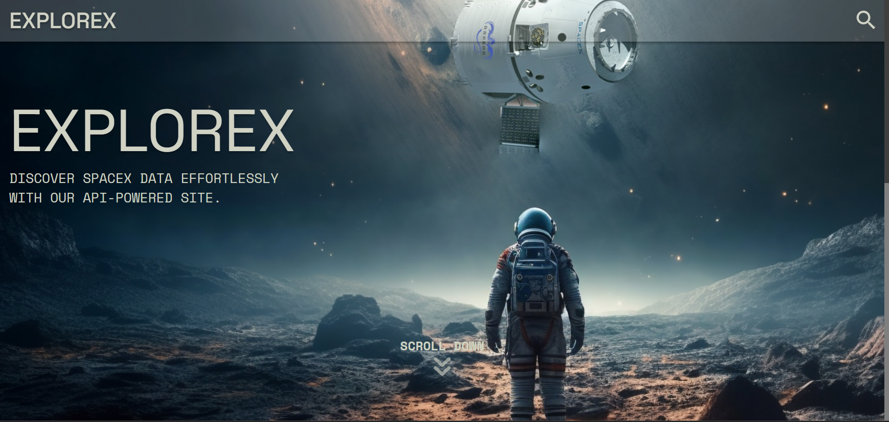
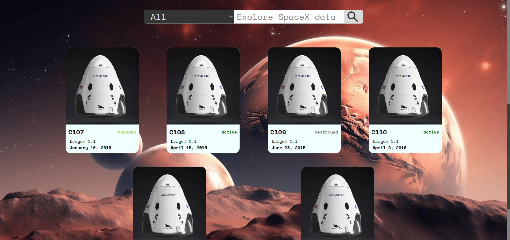
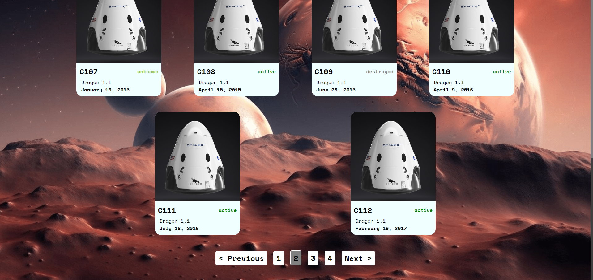
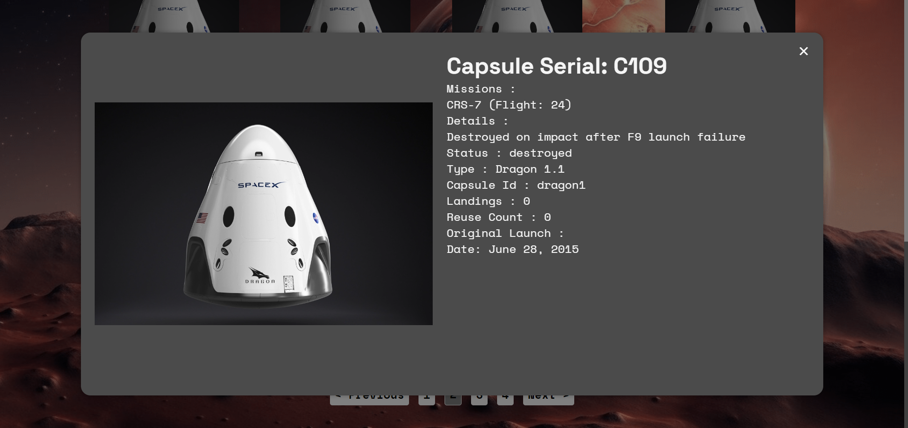
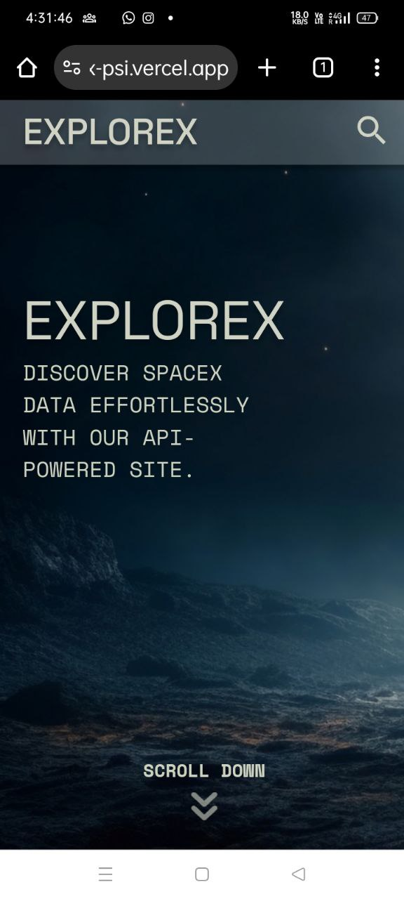
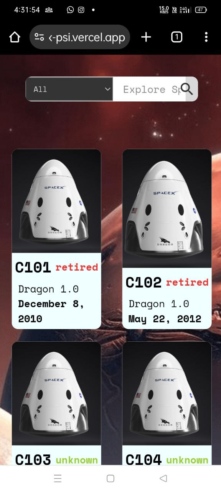

# ExploreX - SpaceX Data Explorer

ExploreX is a React web application designed to showcase SpaceX data, focusing on Capsules. The app utilizes SpaceX's open-sourced data API to fetch and display information in an organized and user-friendly manner.

## Table of Contents
- [Demo](#demo)
- [Screenshots](#screenshots)
- [Features](#features)
- [Technologies Used](#technologies-used)
- [Installation](#installation)
- [Usage](#usage)
- [License](#license)

## Demo

### Screenshots

## Features
- Landing page with modern banner layout.
- Search form with filters.
- Elegant and responsive data grid with pagination.
- Popup/modal to display detailed item data on item click.

## Technologies Used
- React
- HTML CSS
- State Context API 

## Installation
1. Clone the repository: `git clone <repository_url>`
2. Navigate to the project directory: `cd explorex`
3. Install dependencies: `npm install`

## Usage
1. Start the development server: `npm start`
2. Open your browser and visit `http://localhost:3000`

## License
This project is licensed under the MIT License.